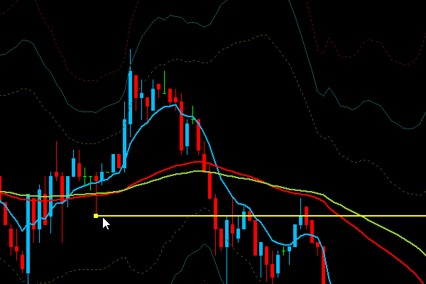

# Horizontal_Line_Assist
Horizontal_Line_Assistは、MetaTraderで水平線を引く作業をアシストすることを目的に開発されたインジゲーターです。  
現在のところ、サポートされているプラットフォームはMetaTrader4のみです。MetaTrader5では動作しません。

## 機能一覧
Horizontal_Line_Assistは、以下の機能を提供します。
+ [ダイレクトライン機能](#ダイレクトライン機能)
+ [マグネット機能](#マグネット機能)
+ [ライン設定記憶機能](#ライン設定保持機能（時間足毎）)
+ [ワンクリック削除機能](#ワンクリック削除機能)
+ [ワンクリックコピー機能](#ワンクリックコピー機能)
+ [前足抜けチェック機能](#前足抜けチェック機能)
+ [トレンドラインを水平線として扱う](#トレンドラインを水平線として扱う)

### ダイレクトライン機能
高値もしくは、安値に対して誤差なく水平線を引く機能、任意の時間に垂直線を引く機能を提供します。

1. 高値もしくは安値にマウスポインターを近づけます。
2. H（高値）もしくは安値（L）のツールチップが表示されます。
3. ツールチップが表示された状態で、右クリックします。
4. コンテキストメニューが表示されます。
5. 上から水平線・トレンドライン・水平線いづれかのボタンをクリックしてください。

 

### マグネット機能
ドラッグした水平線、トレンドラインを高値もしくは、安値に吸着させる機能を提供します。  
水平線もしくはトレンドラインをドラックし、H（高値）もしくは安値（L）のツールチップが表示された状態でドラッグを完了させると、H（高値）もしくは安値（L）にラインが設定されます。

### ライン設定保持機能（時間足毎）
水平線、トレンドライン、垂直線に対して、時間足毎にライン色・ラインスタイル・ライン幅の設定値を保持する機能を提供します。  

### ワンクリック削除機能
Shiftキーを押しながら、削除したいオブジェクトをクリックすることで、チャート上のオブジェクトをワンクリックで削除する機能を提供します。

### ワンクリックコピー機能
Ctrlキーを押しながら、水平線、トレンドライン、垂直線をクリックすることで、クリックされたオブジェクトの設定を複製し、次回以降、同じ時間足で同じオブジェクトを作成する際にその設定を反映させる機能を提供します。  

### 前足抜けチェック機能
前足の高値もしくは安値が更新されていない場合、高値・安値にマウスポインターを近づけた際に表示されるツールチップの文字色が赤色で表示されます。

### トレンドラインを水平線として利用する
トレンドラインを水平線として利用します。

## パラメータ設定
| 変数 | 詳細 | デフォルト |
| :--- | :--- | :---: | 
| 最大吸着距離 | ツールチップが表示される際のマウスポインターと 高値・安値との距離をピクセル単位で指定します。 | 5 |
| Shift+クリック削除機能 | ワンクリック削除機能を有効化します。 | true |
| Ctrl+クリックコピー機能 | ワンクリックコピー機能を有効化します。 | true |
| 前足抜けチェック機能 | 前足抜けチェック機能を有効化します。 | false |
| トレンドラインを水平線として利用 | 水平線をトレンドラインとして利用します。 | true |

## Appendix

### ライン設定をリセットする
ライン設定をリセットする場合、MetaTraderのツール(T)->グローバル変数(V)よりグローバル変数一覧を表示させます。グローバル変数ウィンドウに表示された変数のうち、xx_COLOR、xx_STYLE、xx_WIDTHをすべて削除してください。

### Sync3との統合
有料インジゲーターであるSync3と共に利用する場合、Sync3のTF別自動カラーをtrueに設定してください。